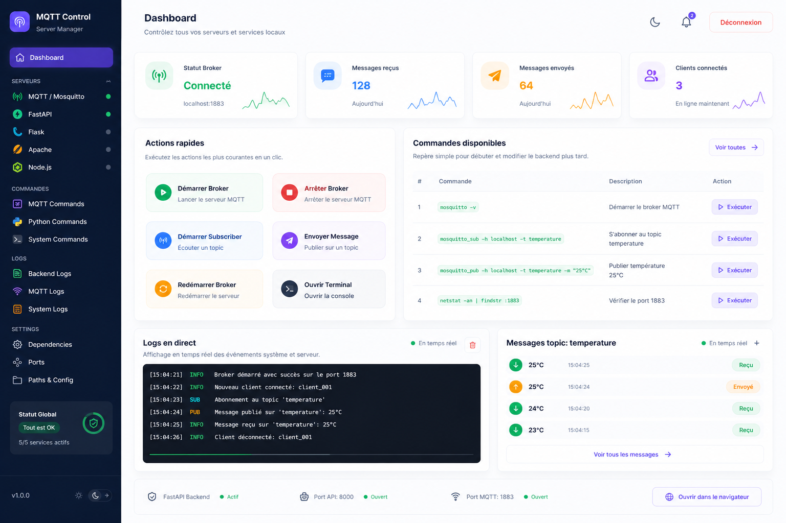

> Note V1 MVP: ce document est conserve comme idee future V2.
> La version active du projet reste `mqtt-dashboard/` tant que la V1 n'est pas terminee.

Tu es un Frontend Engineer senior spécialisé en UI SaaS (Figma → code).

Objectif :
Implémenter une interface web complète (HTML, CSS, JavaScript vanilla) pour une application desktop appelée :

"MQTT Control – Local Server Manager"

L’interface doit être :
- moderne
- claire
- scalable
- facile à comprendre pour débutant
- inspirée des dashboards SaaS (Linear, Vercel, Notion)

---

# 🧱 STRUCTURE DU PROJET

Créer :

/ui
  ├── index.html
  ├── style.css
  └── script.js

---

# 🎨 DESIGN SYSTEM (IMPORTANT)

Couleurs :
- Primary : #6366f1 (violet)
- Success : #22c55e (vert)
- Danger : #ef4444 (rouge)
- Warning : #f59e0b (orange)
- Background : #f8fafc
- Card : #ffffff
- Text : #0f172a
- Subtext : #64748b

UI Rules :
- Border radius : 12px
- Padding : 16px
- Shadow : léger (box-shadow doux)
- Espacement constant (8px / 16px / 24px)
- Layout = Flexbox (pas Grid complexe)

---

# 🧭 LAYOUT GLOBAL

Disposition :

[ Sidebar ] [ Main Content ]

Sidebar = largeur fixe (240px)
Main = flexible (100%)

---

# 📚 SIDEBAR (STRUCTURÉE & CASCADE)

Sections :

1. Dashboard

2. SERVEURS
   - MQTT / Mosquitto
   - FastAPI
   - Flask
   - Apache
   - Node.js

3. COMMANDES
   - MQTT Commands
   - Python Commands
   - System Commands

4. LOGS
   - Backend Logs
   - MQTT Logs
   - System Logs

5. SETTINGS
   - Dependencies
   - Ports
   - Paths & Config

Comportement :
- Sections collapsibles (toggle open/close)
- Item actif = fond violet clair + bord gauche
- Chaque serveur affiche :
  ● vert = actif
  ○ gris = inactif

---

# 🧠 HEADER

Contient :
- Titre : Dashboard
- Sous-titre : "Contrôlez vos serveurs localement"
- Boutons :
  - Mode nuit
  - Déconnexion

---

# 📊 CARTES KPI

Afficher 4 cartes :

1. Statut Broker → "Connecté"
2. Messages reçus → 128
3. Messages envoyés → 64
4. Clients connectés → 3

Design :
- Cartes alignées horizontalement
- icône + valeur + label
- petite ligne graphique simulée (CSS simple)

---

# ⚡ ACTIONS RAPIDES

Boutons :

- Démarrer Broker (vert)
- Arrêter Broker (rouge)
- Démarrer Subscriber (bleu)
- Envoyer Message (violet)
- Redémarrer Broker (orange)
- Ouvrir Terminal (noir)

Comportement JS :
Chaque bouton appelle :

runCommand("command_name")

---

# 📋 TABLE COMMANDES

Colonnes :
- #
- Commande
- Description
- Action

Lignes :

1. mosquitto -v
2. mosquitto_sub -h localhost -t temperature
3. mosquitto_pub -h localhost -t temperature -m "25°C"
4. netstat -an | findstr :1883

Bouton :
→ "Exécuter"

---

# 🖥️ LOGS EN DIRECT

Design :
- fond noir
- texte vert style terminal

Contenu simulé :

[INFO] Broker démarré
[SUB] Abonnement temperature
[PUB] Message envoyé
[INFO] Client connecté

---

# 📡 MESSAGES MQTT

Liste simple :

- 25°C (Reçu)
- 25°C (Envoyé)
- 24°C (Reçu)

Badge couleur :
- vert = reçu
- orange = envoyé

---

# ⚙️ JAVASCRIPT

Fonction principale :

function runCommand(cmd) {
  // 1. afficher dans logs
  // 2. appel API FastAPI
  fetch("http://127.0.0.1:8000/api/commands/" + cmd, { method: "POST" })
}

+ gérer erreurs
+ afficher réponse JSON

---

# ⚠️ UX IMPORTANT

- Dashboard = plein écran
- Aucun panneau debug visible par défaut
- Settings = page séparée pour diagnostics
- Si erreur → afficher toast simple

---

# 📱 RESPONSIVE

- Sidebar collapsible en mobile
- Cartes passent en colonne

---

# 🎯 OBJECTIF FINAL

Créer une UI :
- claire
- modulaire
- prête à connecter à FastAPI
- facilement migrable vers React plus tard

---

# 📦 LIVRABLES

Donner :
1. index.html complet
2. style.css propre
3. script.js fonctionnel
4. code commenté pour débutant
