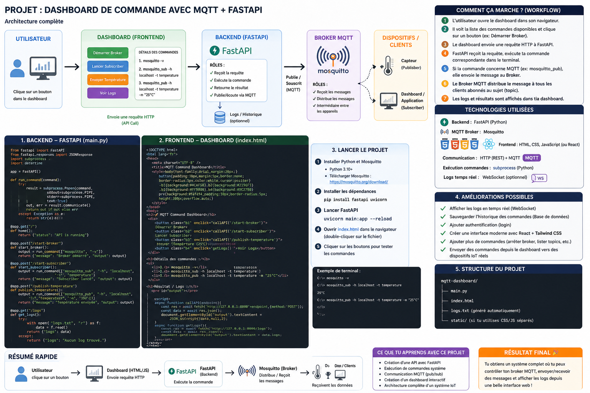

Tu es en train de décrire **un très bon mini-projet pro** 👌
👉 un **dashboard qui pilote des commandes système (MQTT)** avec bouton → exécution

Je vais te structurer ça **simple + clair + faisable rapidement**

---

# 🧠 🎯 Objectif du mini projet

👉 Créer une app avec :

* ⚙️ **FastAPI (backend)** → exécute commandes
* 🖥️ **Dashboard (frontend)** → boutons + affichage
* 📡 **Mosquitto** → système réel derrière

---

# 🧩 🧠 Architecture simple


---

# 🔄 Workflow (très important)

👉 L’utilisateur clique bouton :

```id="uxsnqn"
[Dashboard] → [FastAPI] → [Commande système] → [Mosquitto]
```

---

# 🧠 Traduction simple

* bouton = action utilisateur
* FastAPI = cerveau
* Mosquitto = système de communication

---

# 🧱 1. Backend FastAPI (simple)

👉 fichier `main.py`

```python
from fastapi import FastAPI
import subprocess

app = FastAPI()

@app.get("/")
def home():
    return {"status": "ok"}

@app.post("/start-broker")
def start_broker():
    subprocess.Popen(["mosquitto", "-v"])
    return {"message": "Mosquitto démarré"}

@app.post("/subscribe")
def subscribe():
    subprocess.Popen(["mosquitto_sub", "-h", "localhost", "-t", "temperature"])
    return {"message": "Subscriber lancé"}

@app.post("/publish")
def publish():
    subprocess.Popen(["mosquitto_pub", "-h", "localhost", "-t", "temperature", "-m", "25°C"])
    return {"message": "Message envoyé"}
```

---

# 🖥️ 2. Frontend simple (HTML)

👉 fichier `index.html`

```html
<!DOCTYPE html>
<html>
<body>

<h2>MQTT Dashboard</h2>

<button onclick="callAPI('/start-broker')">Start Mosquitto</button>
<button onclick="callAPI('/subscribe')">Start Subscriber</button>
<button onclick="callAPI('/publish')">Send Temperature</button>

<pre id="output"></pre>

<script>
function callAPI(route) {
    fetch("http://127.0.0.1:8000" + route, {
        method: "POST"
    })
    .then(res => res.json())
    .then(data => {
        document.getElementById("output").innerText = JSON.stringify(data, null, 2);
    });
}
</script>

</body>
</html>
```

---

# 🚀 3. Lancer le projet

### 1. Lancer FastAPI

```bash
uvicorn main:app --reload
```

---

### 2. Ouvrir HTML

👉 double-clique `index.html`

---

# 🎯 Résultat

👉 Tu auras :

* bouton "Start Mosquitto"
* bouton "Subscribe"
* bouton "Publish"

👉 et tu vois les actions en direct

---

# 🧠 Ce que tu construis (important)

👉 Ce n’est pas juste un test

Tu construis :

* un **système de contrôle**
* une **interface utilisateur**
* un **orchestrateur de commandes**

👉 EXACTEMENT ce que font :

* systèmes IoT
* outils DevOps
* dashboards IA

---

# ⚠️ Amélioration (pro)

👉 après MVP :

* afficher logs en temps réel
* remplacer `subprocess` par MQTT Python (`paho-mqtt`)
* ajouter WebSocket
* sécuriser commandes

---

# 🧠 Version PRO (pour ton portfolio)

👉 Tu peux appeler ça :

👉 **"AI Command Orchestrator Dashboard"**

---

# 💡 Idée bonus (très forte pour toi)

👉 connecter IA :

* utilisateur écrit : “envoie température”
* IA → choisit commande
* backend → exécute

👉 🔥 énorme valeur marché

---

# 👉 Dis-moi

Tu veux que je t’aide à faire :

✅ version **React propre (pro UI)**
ou
✅ ajouter **IA (langage naturel → commande)**

👉 ça peut devenir TON projet portfolio principal 💼
