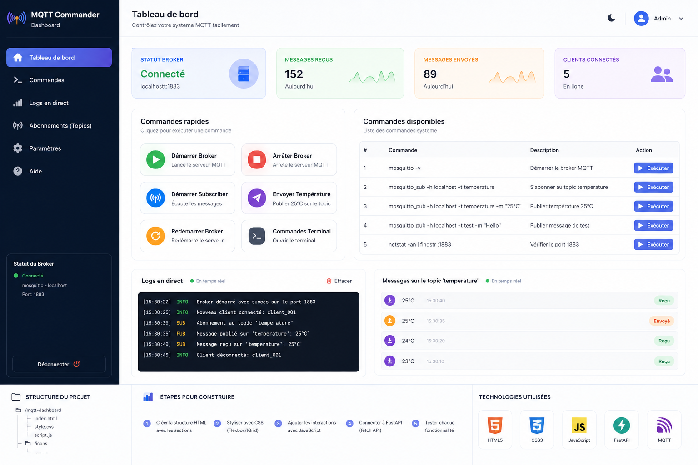

Parfait 👍 tu veux quelque chose de **simple, propre, comme Figma → facile à coder**
👉 on va faire une **version ultra simplifiée (débutant)** mais **propre UI/UX**

---

# 🎨 🧠 Design simple (logique Figma)


---

# 🎯 Objectif UI

👉 3 zones seulement (très simple) :

1. **Boutons (actions)**
2. **Liste commandes**
3. **Logs (résultat)**

---

# 🧱 Structure HTML (facile à comprendre)

```html
<!DOCTYPE html>
<html>
<head>
  <title>MQTT Simple Dashboard</title>
  <style>
    body {
      font-family: Arial;
      background: #f5f5f5;
      padding: 20px;
    }

    h1 {
      text-align: center;
    }

    .container {
      display: flex;
      gap: 20px;
    }

    .box {
      background: white;
      padding: 15px;
      border-radius: 10px;
      width: 33%;
      box-shadow: 0 2px 5px rgba(0,0,0,0.1);
    }

    button {
      width: 100%;
      padding: 10px;
      margin-top: 10px;
      border: none;
      border-radius: 5px;
      cursor: pointer;
      background: #4CAF50;
      color: white;
    }

    button:hover {
      background: #45a049;
    }

    pre {
      background: #111;
      color: #0f0;
      padding: 10px;
      height: 200px;
      overflow: auto;
    }
  </style>
</head>

<body>

<h1>MQTT Dashboard (Simple)</h1>

<div class="container">

  <!-- ACTIONS -->
  <div class="box">
    <h3>Actions</h3>
    <button onclick="callAPI('/start-broker')">Start Broker</button>
    <button onclick="callAPI('/subscribe')">Start Subscriber</button>
    <button onclick="callAPI('/publish')">Send Message</button>
  </div>

  <!-- COMMANDES -->
  <div class="box">
    <h3>Commandes</h3>
    <ul>
      <li>mosquitto -v</li>
      <li>mosquitto_sub -h localhost -t temperature</li>
      <li>mosquitto_pub -h localhost -t temperature -m "25°C"</li>
    </ul>
  </div>

  <!-- LOGS -->
  <div class="box">
    <h3>Logs</h3>
    <pre id="logs">...</pre>
  </div>

</div>

<script>
function callAPI(route) {
  fetch("http://127.0.0.1:8000" + route, {
    method: "POST"
  })
  .then(res => res.json())
  .then(data => {
    document.getElementById("logs").innerText =
      JSON.stringify(data, null, 2);
  });
}
</script>

</body>
</html>
```

---

# 🧠 Pourquoi c’est parfait pour débutant

👉 Tu comprends tout :

* bouton → action
* action → API
* API → commande système
* résultat → affiché

---

# 🔄 Workflow simple

```text
[CLICK BUTTON]
      ↓
[FastAPI]
      ↓
[Commande mosquitto]
      ↓
[Résultat affiché]
```

---

# 🎯 Résultat

👉 Tu peux :

* démarrer Mosquitto
* écouter topic
* envoyer message
* voir réponse

---

# 🧠 Version encore plus simple (mental)

👉 Ton projet =

```text
Télécommande → Serveur → Action
```

---

# 🚀 Niveau supérieur (quand tu es prêt)

Ensuite tu peux ajouter :

* 🔴 logs en temps réel
* 🟢 status connecté / offline
* 📊 compteur messages
* 🤖 IA (texte → commande)

---

# 💡 Important pour ton portfolio

👉 Ce projet devient :

👉 **“Dashboard de contrôle IoT avec FastAPI + MQTT”**

✔️ simple
✔️ compréhensible
✔️ démontrable

---

# 👉 Dis-moi

Tu veux maintenant :

✅ version **React (pro)**
ou
✅ ajouter **logs en temps réel (comme vrai système)**

👉 on peut transformer ça en projet **niveau ingénieur IA direct 💼**

