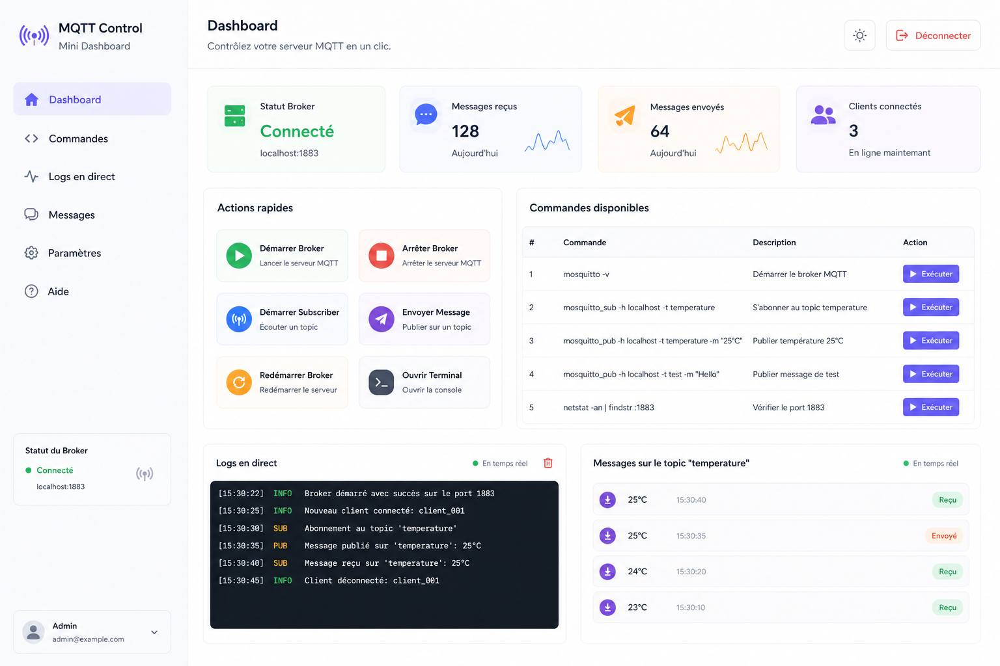

Voici un **prompt d’implémentation** prêt à coller dans une IA de code :

```text
Tu es un développeur frontend senior.

Objectif :
Créer une mini interface SaaS en HTML, CSS et JavaScript vanilla pour contrôler un serveur MQTT via une API FastAPI.

Style UI/UX :
- Dashboard simple, clair, débutant-friendly
- Inspiration SaaS moderne
- Fond clair
- Sidebar à gauche
- Cartes arrondies
- Boutons visibles
- Logs en style terminal sombre
- Interface facile à transformer en React plus tard

Technologies :
- HTML
- CSS
- JavaScript vanilla
- Fetch API vers FastAPI

Structure demandée :
/mqtt-dashboard
  ├── index.html
  ├── style.css
  └── script.js

Layout :
1. Sidebar gauche
   - Logo : MQTT Control
   - Menu :
     - Dashboard
     - Commandes
     - Logs
     - Paramètres
   - Carte statut broker : Connecté / Déconnecté

2. Header
   - Titre : Dashboard
   - Sous-titre : Contrôlez votre serveur MQTT facilement
   - Bouton Déconnexion fictif

3. Cartes statistiques
   - Statut Broker : Connecté
   - Messages reçus : 128
   - Messages envoyés : 64
   - Clients connectés : 3

4. Actions rapides
   Boutons :
   - Démarrer Broker
   - Arrêter Broker
   - Démarrer Subscriber
   - Envoyer Message
   - Redémarrer Broker
   - Ouvrir Terminal

5. Tableau des commandes disponibles
   Colonnes :
   - #
   - Commande
   - Description
   - Action

   Lignes :
   - mosquitto -v : Démarrer le broker MQTT
   - mosquitto_sub -h localhost -t temperature : S’abonner au topic temperature
   - mosquitto_pub -h localhost -t temperature -m "25°C" : Publier température 25°C
   - netstat -an | findstr :1883 : Vérifier le port 1883

6. Logs en direct
   Afficher des lignes simulées :
   - [INFO] Broker démarré
   - [SUB] Abonnement au topic temperature
   - [PUB] Message envoyé : 25°C
   - [INFO] Client connecté

7. Messages topic temperature
   Liste de messages :
   - 25°C reçu
   - 25°C envoyé
   - 24°C reçu

Comportement JavaScript :
- Chaque bouton appelle une fonction runCommand(commandName)
- Cette fonction doit :
  1. afficher immédiatement une ligne dans les logs
  2. appeler FastAPI avec fetch POST vers :
     http://127.0.0.1:8000/api/commands/{commandName}
  3. afficher la réponse JSON dans les logs
  4. gérer les erreurs si FastAPI n’est pas démarré

Routes attendues côté backend :
- POST /api/commands/start-broker
- POST /api/commands/stop-broker
- POST /api/commands/start-subscriber
- POST /api/commands/publish-temperature
- POST /api/commands/restart-broker
- POST /api/commands/open-terminal

Contraintes :
- Code complet et fonctionnel
- Pas de framework
- CSS bien organisé
- Responsive simple
- Commentaires pédagogiques dans le code
- Ne pas compliquer
- Priorité : débutant peut comprendre et modifier facilement

Livrables :
1. index.html complet
2. style.css complet
3. script.js complet
```

Tu peux l’utiliser directement pour générer le projet HTML/CSS/JS.
